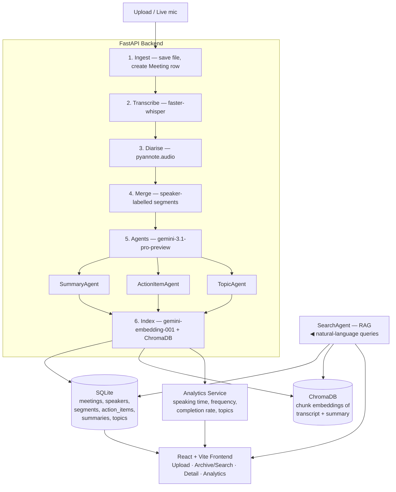

# Architecture

## Overview

The whole ingest pipeline runs in a background task so the upload request returns
immediately; the frontend polls meeting status (`queued → transcribing → diarising →
analysing → indexing → done`).

## Components

### Transcription (`services/transcription.py`)
- `faster-whisper` (`WhisperModel`) with `word_timestamps=True`.
- Returns segments `{start, end, text, words[]}`.
- Model size / device / compute type are configurable; `int8` on CPU for speed.

### Diarisation (`services/diarization.py`)
- `pyannote.audio` `Pipeline.from_pretrained("pyannote/speaker-diarization-3.1")`.
- Produces `{start, end, speaker}` turns.
- **Merge:** each Whisper segment is assigned the speaker whose turns overlap it most.
- **Graceful degradation:** if `HF_TOKEN` is missing/invalid, everything is labelled
  `Speaker 1` and the rest of the pipeline still works.

### Agents (`agents/`)
All use `gemini-3.1-pro-preview` through a single defensive client
(`agents/gemini_client.py`) that:
- requests `response_mime_type="application/json"`,
- sets `thinking_config(thinking_level=...)`,
- supports `system_instruction`,
- **degrades gracefully** — if the installed SDK rejects a parameter, it retries without it,
- robustly parses JSON (strips code fences) and validates with Pydantic.

- **SummaryAgent** → `{overview, attendees, key_decisions, discussion_points, open_questions, next_steps}`
- **ActionItemAgent** → `[{task, owner, deadline}]`
- **TopicAgent** → `[topic]` (normalised keywords for recurring-topic analytics)
- **SearchAgent** → retrieves top-k chunks from ChromaDB and synthesises a cited answer

### RAG (`services/embeddings.py`, `services/vectorstore.py`)
- Chunk transcript (by speaker turn / window) + the summary sections.
- Embed with `gemini-embedding-001` (`task_type=RETRIEVAL_DOCUMENT`, 768-dim).
- Store in ChromaDB with metadata `{meeting_id, type, speaker, start, end}`.
- Query embeds with `task_type=RETRIEVAL_QUERY`; results carry citations.

### Analytics (`services/analytics.py`)
- **Speaking time:** sum of segment durations grouped by resolved speaker name.
- **Frequency:** meetings grouped by day/week.
- **Completion rate:** `completed / total` action items.
- **Recurring topics:** topic frequency across meetings.

## Data model (SQLite via SQLAlchemy)
- `meetings(id, title, created_at, duration, audio_path, status, stage, error, language)`
- `speakers(id, meeting_id, label, display_name)`
- `transcript_segments(id, meeting_id, speaker_id, start, end, text)`
- `action_items(id, meeting_id, task, owner, deadline, completed)`
- `summaries(meeting_id, overview, attendees, key_decisions, discussion_points, open_questions, next_steps)` (JSON columns)
- `topics(id, meeting_id, topic)`

## API surface (FastAPI)
- `POST /api/meetings` — upload audio (multipart), starts pipeline → `{id, status}`
- `GET  /api/meetings` — list
- `GET  /api/meetings/{id}` — detail (transcript, summary, action items, speakers, status)
- `DELETE /api/meetings/{id}` — delete (DB + vectors + file)
- `POST /api/meetings/{id}/reprocess` — re-run pipeline
- `PATCH /api/speakers/{id}` — rename speaker
- `PATCH /api/action-items/{id}` — toggle completion
- `POST /api/search` — `{query}` → cited RAG answer + matches
- `GET  /api/analytics/...` — speaking-time, frequency, completion, topics

## ADK bonus layer (`backend/adk_app/`)
An optional [Google ADK](https://google.github.io/adk-docs/) agent — `meeting_assistant`
(`gemini-3.1-pro-preview`) — exposes the platform to a tool-using agent via `adk web` /
`adk run`. Tools: `list_meetings`, `get_meeting_transcript(id)`, `search_archive(query)`
(reuses the RAG service). It is **additive**: the FastAPI product does not import or depend
on it, so ADK's dependency quirks (an older opentelemetry pin) never affect the product.
See [`backend/adk_app/README.md`](../backend/adk_app/README.md).

## Key decisions
- **Python 3.11 venv** — system Python is 3.14, which lacks torch/pyannote/ctranslate2 wheels.
- **Gemini model in one constant** (`config.GEMINI_MODEL`) — swap models in one place.
- **google-genai for the in-product agent layer; ADK as an additive bonus** — the product's
  agents run on `google-genai` (rock-solid, fully testable offline); ADK ships as a separate,
  runnable `adk_app/` package so the assignment's "use ADK" preference is met without coupling
  the product to ADK's heavier dependency surface.
- **PyAV for audio conversion** — no dependency on a system `ffmpeg` binary.
- **Background pipeline + status polling** — keeps the upload endpoint responsive and the
  UI honest about long-running transcription.
