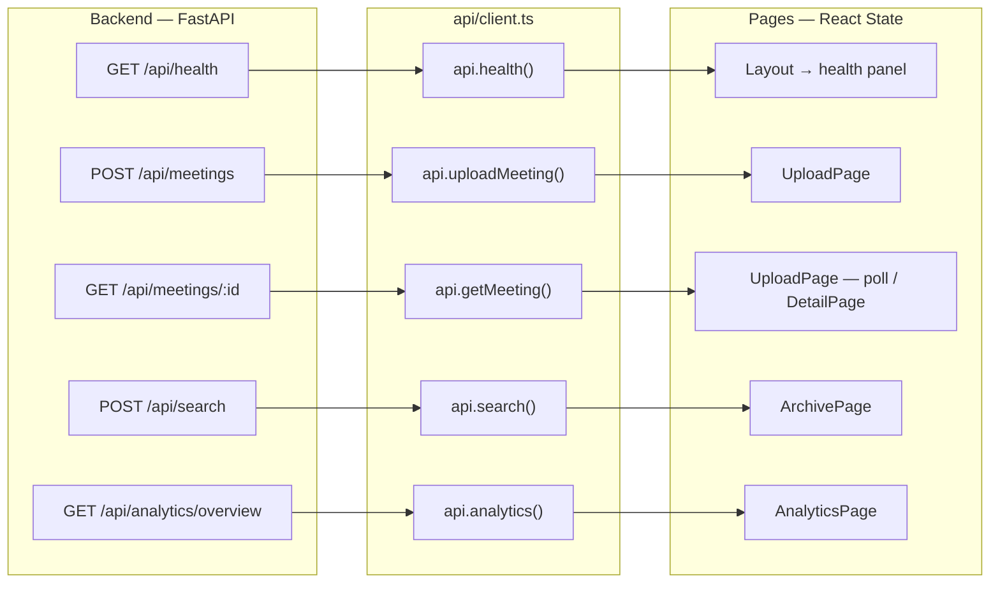
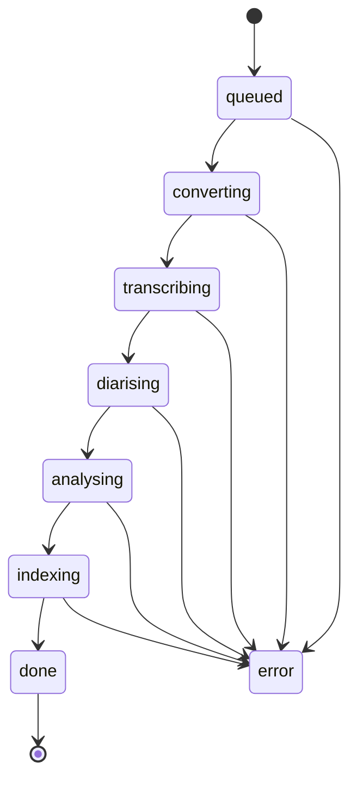

# Frontend Internals & Data

How data moves through the web client: the shapes it receives from the backend, the
processing-stage state machine the UI tracks, and how each page consumes that data.

> Setup & structure: [FRONTEND.md](FRONTEND.md) · Full system design: [ARCHITECTURE.md](ARCHITECTURE.md).

---

## Data flow at a glance

The client never holds a global store — each page fetches what it needs with `useEffect` and
keeps it in local component state. The only cross-cutting fetch is `api.health()` in `Layout`.

All response shapes are declared in [`types.ts`](../frontend/src/types.ts); the table below maps
each endpoint to its type.

| Endpoint                       | TypeScript type        |
|--------------------------------|------------------------|
| `GET /api/health`              | `Health`               |
| `GET /api/meetings`            | `MeetingListItem[]`    |
| `GET /api/meetings/:id`        | `MeetingDetail`        |
| `POST /api/meetings`           | `MeetingListItem`      |
| `POST /api/search`             | `SearchResponse`       |
| `GET /api/analytics/overview`  | `AnalyticsOverview`    |

---

## The processing-stage state machine

When a recording is uploaded the backend runs the pipeline in the background and the UI polls
`GET /api/meetings/:id`, reading the `stage` field. The frontend owns the human-readable labels,
the ordering, and the progress percentage — all in [`utils.ts`](../frontend/src/utils.ts).

| `stage`        | Label (`STAGE_LABELS`)   |
|----------------|--------------------------|
| `queued`       | Queued                   |
| `converting`   | Converting audio         |
| `transcribing` | Transcribing             |
| `diarising`    | Identifying speakers     |
| `analysing`    | Analysing with Gemini    |
| `indexing`     | Indexing for search      |
| `done`         | Done                     |
| `error`        | Error                    |

`stageProgress(stage)` converts the stage into a 0–100% bar by its index in `STAGE_ORDER`. To add
or reorder a pipeline stage on the frontend, update **both** `STAGE_LABELS` and `STAGE_ORDER` —
they must stay in sync or the progress bar mis-maps.

---

## Per-page data lifecycle

### UploadPage (`/`)
1. `api.uploadMeeting(file, title?)` → returns the new `MeetingListItem`.
2. Polls `api.getMeeting(id)` on an interval, reading `stage` to drive the progress UI.
3. Stops polling when `stage === "done"` (or `"error"`).

### ArchivePage (`/archive`)
- Loads the list via `api.listMeetings()` (`MeetingListItem[]`).
- Search posts the query to `api.search(query, opts?)`; renders `SearchResponse.answer` plus the
  ranked `matches[]`, each carrying a citation (`meeting_id`, `start`/`end`, `score`).

### MeetingDetailPage (`/meetings/:id`)
- Loads the full `MeetingDetail`: `segments[]` (transcript), `summary`, `action_items[]`,
  `speakers[]`, `topics[]`.
- Mutations are optimistic-friendly single calls: `api.renameSpeaker`, `api.toggleActionItem`,
  `api.renameMeeting`, `api.reprocessMeeting`, `api.deleteMeeting`.

### AnalyticsPage (`/analytics`)
- One call to `api.analytics()` returns the whole `AnalyticsOverview`:
  totals, `completion_rate`, `speaking_time[]`, `frequency[]`, and `top_topics[]` — each array
  rendered as its own chart/bar set.

---

## Formatting & display helpers (`utils.ts`)

| Helper                  | Purpose                                              |
|-------------------------|------------------------------------------------------|
| `formatDuration(s)`     | seconds → `m:ss` or `Hh Mm` (used for meeting length)|
| `formatTime(s)`         | seconds → `m:ss` (transcript timestamps)             |
| `formatDate(iso)`       | ISO string → localized date/time (treats naïve times as UTC) |
| `stageProgress(stage)`  | stage name → 0–100 progress percent                  |

Keep all time/number formatting in `utils.ts` so transcript timestamps, durations, and analytics
stay consistent across pages.

---

## Conventions when extending

- New backend data → add its type to `types.ts` first, then the `api` method, then consume it in
  the page. Components should never see an untyped `any` payload.
- Anything tied to pipeline stages must update `STAGE_LABELS` **and** `STAGE_ORDER` together.
- Speaker identity is colour-coded deterministically via `speakerColor()` in `colors.ts`, so the
  same speaker reads the same colour across transcript, detail, and analytics views.
