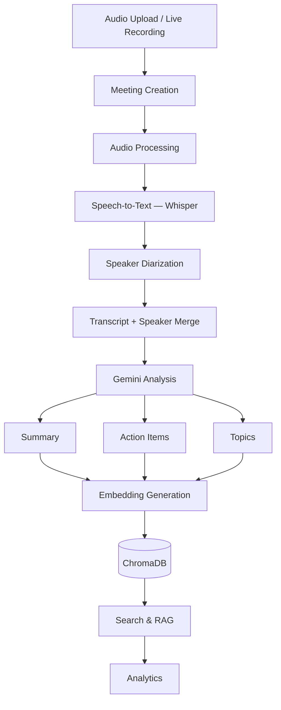
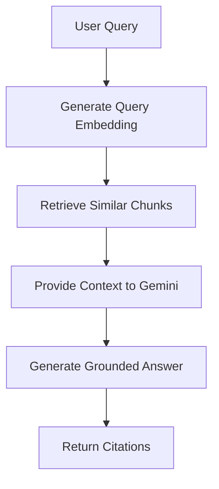
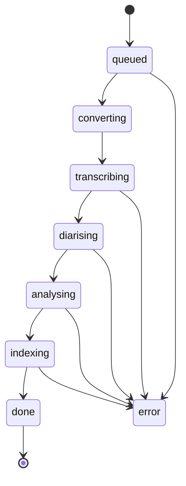

# Meeting Processing Pipeline

## Overview

The Meeting Intelligence Platform transforms raw meeting recordings into structured, searchable knowledge through a multi-stage AI pipeline.

The pipeline combines speech recognition, speaker identification, large language models, vector search, and analytics to generate meeting insights automatically.

---

## End-to-End Workflow



---

## Stage 1: Meeting Ingestion

### Purpose

Accept a meeting recording and prepare it for processing.

### Input

- Audio upload
- Live microphone recording

### Operations

- Validate file
- Store audio locally
- Create database record
- Generate meeting identifier
- Mark meeting as queued

### Output

- Stored audio file
- Meeting ID
- Processing job

---

## Stage 2: Speech Transcription

### Technology

- faster-whisper

### Purpose

Convert spoken language into text with timestamps.

### Operations

- Audio preprocessing
- Speech recognition
- Word timestamp generation
- Segment generation

### Output Example

```json
{
  "start": 0.0,
  "end": 3.2,
  "text": "Let's review the pricing proposal."
}
```

---

## Stage 3: Speaker Diarization

### Technology

- pyannote.audio

### Purpose

Identify who is speaking throughout the meeting.

### Operations

- Detect speaker changes
- Separate voices
- Create speaker segments
- Assign speaker labels

### Output Example

```json
{
  "speaker": "Speaker 1",
  "start": 0.0,
  "end": 4.5
}
```

---

## Stage 4: Transcript Merge

### Purpose

Combine transcription results with speaker information.

### Example

```text
Speaker 1:
Welcome everyone to today's meeting.

Speaker 2:
Let's review the pricing proposal.

Speaker 1:
The engineering team has completed the API integration.
```

This stage creates the final speaker-labelled transcript used by all downstream services.

---

## Stage 5: AI Analysis

### Technology

- Gemini 3.1 Pro Preview

### Summary Agent

Generates:

- Attendees
- Key decisions
- Discussion points
- Open questions
- Next steps

### Action Item Agent

Extracts:

- Task
- Owner
- Deadline

### Topic Agent

Extracts:

- Meeting themes
- Keywords
- Recurring discussion topics

---

## Stage 6: Embedding Generation

### Technology

- gemini-embedding-001

### Purpose

Convert meeting content into vector representations for semantic search.

### Operations

- Transcript chunking
- Summary chunking
- Embedding generation

### Output

768-dimensional vector embeddings.

---

## Stage 7: Vector Indexing

### Technology

- ChromaDB

### Purpose

Store embeddings for retrieval-augmented generation (RAG).

### Stored Metadata

- Meeting ID
- Speaker
- Timestamp
- Chunk type

### Benefits

- Semantic search
- Fast retrieval
- Context-aware question answering

---

## Stage 8: Retrieval-Augmented Generation (RAG)

### Query Flow



### Example Questions

- What did we decide about pricing?
- Who owns the backend changes?
- What open questions remain?
- Which tasks are due this week?

---

## Stage 9: Analytics Generation

The analytics service continuously derives insights from stored meeting data.

### Metrics

#### Speaking Time

Tracks participation across speakers.

#### Meeting Frequency

Measures meeting activity over time.

#### Action Item Completion Rate

Tracks progress on assigned tasks.

#### Recurring Topics

Identifies themes discussed across multiple meetings.

---

## Failure Recovery Strategy

The platform follows a graceful degradation approach.

### Missing Hugging Face Token

- Diarization is disabled.
- All segments are labelled as Speaker 1.
- Processing continues successfully.

### Gemini API Failure

- Transcript remains available.
- Analysis can be regenerated later.
- Existing meeting data is preserved.

### ChromaDB Failure

- Search functionality becomes unavailable.
- Meeting content remains accessible through SQLite.

### Upload Failure

- Invalid files are rejected.
- Error information is stored for debugging.

---

## Status Lifecycle

Meetings move through the following states:



If any stage fails, the meeting enters an error state and can be reprocessed.

---

## Future Enhancements

Potential future improvements include:

- Real-time meeting transcription
- Live speaker identification
- Streaming summaries
- Multi-language support
- Sentiment analysis
- Enterprise authentication
- Distributed processing workers
- Multi-tenant architecture